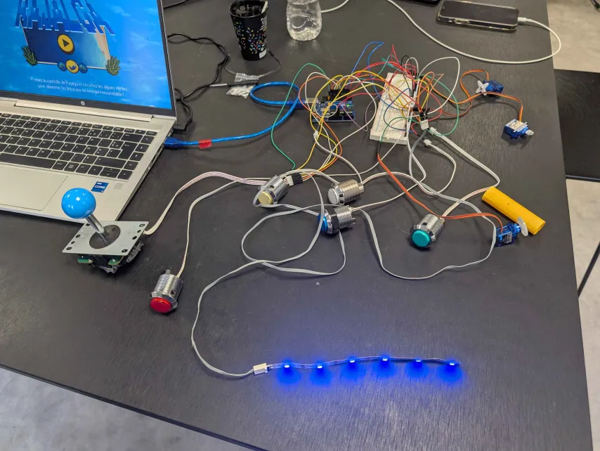
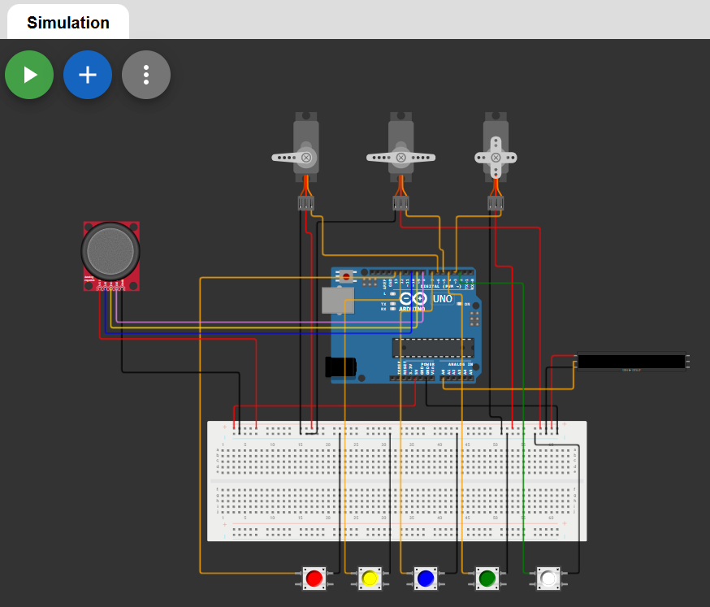
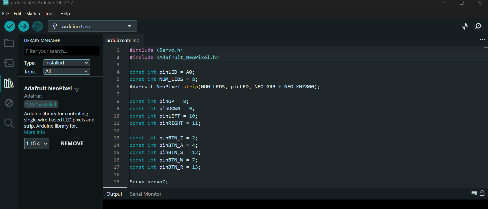

# Boutons & Joystick - Contrôleur Arduino

## Présentation

Ce projet permet de contrôler un jeu PC à l'aide d'un **joystick arcade**, de **boutons poussoirs**, de **LEDs NeoPixel** et de **servomoteurs**, le tout piloté par une carte **Arduino Uno**. Un script Python écoute les données série envoyées par l'Arduino et les convertit en appuis clavier.



## Schéma de câblage

Le schéma ci-dessous montre le branchement des composants sur l'Arduino Uno. Vous pouvez aussi le consulter en simulation sur Wokwi : https://wokwi.com/projects/459407329683459073



### Connexions des pins

| Composant | Pin Arduino |
|-----------|-------------|
| Joystick HAUT | 8 |
| Joystick BAS | 9 |
| Joystick GAUCHE | 10 |
| Joystick DROITE | 11 |
| Bouton Z | 2 |
| Bouton A | 4 |
| Bouton S | 12 |
| Bouton W | 7 |
| Bouton R (reset) | 13 |
| LEDs NeoPixel | A0 |
| Servo Z | 3 |
| Servo A | 5 |
| Servo S | 6 |

---

## Étape 1 : Installer la bibliothèque Adafruit NeoPixel dans l'IDE Arduino

1. Ouvrez l'**IDE Arduino**
2. Allez dans le **Library Manager** (menu à gauche ou via *Sketch > Include Library > Manage Libraries*)
3. Recherchez **"Adafruit NeoPixel"**
4. Cliquez sur **Install** pour installer la bibliothèque (version 1.16.4 ou plus récente)



> **Note :** La bibliothèque **Servo** est incluse par défaut dans l'IDE Arduino, pas besoin de l'installer.

---

## Étape 2 : Téléverser le code Arduino

1. Branchez votre carte **Arduino Uno** à votre PC via un câble USB
2. Ouvrez le fichier `joystick.ino` dans l'IDE Arduino
3. Sélectionnez la bonne carte : *Tools > Board > Arduino Uno*
4. Sélectionnez le bon port série : *Tools > Port > COMx* (le port où votre Arduino est connecté)
5. Cliquez sur le bouton **Upload** (flèche vers la droite) pour téléverser le code
6. **Fermez le Serial Monitor** de l'IDE Arduino après le téléversement (important pour libérer le port série)

---

## Étape 3 : Utiliser le listener Python

Le script `pythonListen.py` lit les messages envoyés par l'Arduino sur le port série et simule les touches clavier correspondantes sur le PC.

### Prérequis

Installez les dépendances Python nécessaires :

```bash
pip install pyserial pyautogui
```

### Lancement

```bash
python pythonListen.py
```

Le script va :
1. **Détecter automatiquement** le port série de l'Arduino
2. Si plusieurs ports sont trouvés, vous pourrez choisir le bon
3. Afficher `Connexion établie sur COMx !` quand tout est prêt

### Correspondance des touches

| Action sur le contrôleur | Touche clavier simulée |
|--------------------------|----------------------|
| Joystick Haut | `↑` (flèche haut) |
| Joystick Bas | `↓` (flèche bas) |
| Joystick Gauche | `←` (flèche gauche) |
| Joystick Droite | `→` (flèche droite) |
| Bouton Z | `Z` |
| Bouton A | `A` |
| Bouton S | `S` |
| Bouton W | `W` |
| Bouton R | `R` |

### En cas d'erreur

- **"Aucun port série trouvé"** : Vérifiez que l'Arduino est bien branché en USB
- **Erreur de connexion** : Assurez-vous que le **Serial Monitor de l'IDE Arduino est fermé** (il bloque le port série)
- **Les touches ne fonctionnent pas** : Vérifiez que la fenêtre de votre jeu est bien au premier plan
- **sinon** pour toutes questions ou difficultés contactez moi via mon adresse mail : achraf.yasmine@etu.univ-nantes.fr

---

## Fonctionnement du système d'étapes

Le code Arduino suit une séquence d'étapes avec retour visuel via les LEDs NeoPixel :

| Étape | Condition | LED | Action |
|-------|-----------|-----|--------|
| 0 | Appuyer 7× sur Z | - | Comptage des appuis |
| 1 | Appuyer sur W | Jaune | Activation moteur Z |
| 2 | Appuyer sur S | Vert | Activation moteur S |
| 3 | Appuyer sur A | Blanc | Activation moteur A |
| 4 | - | Rouge | Séquence terminée |
| Reset | Appuyer sur R | Bleu | Retour à l'étape 0 |
