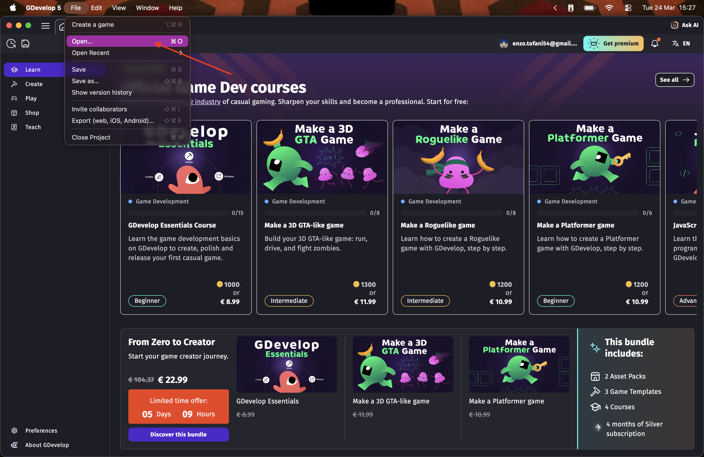
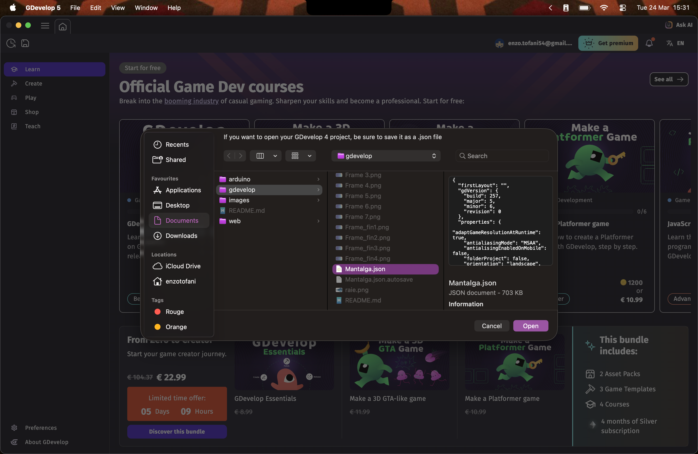
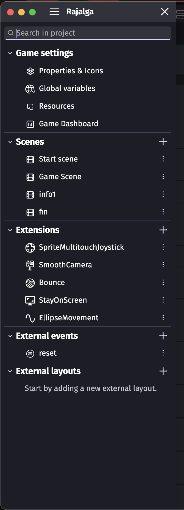
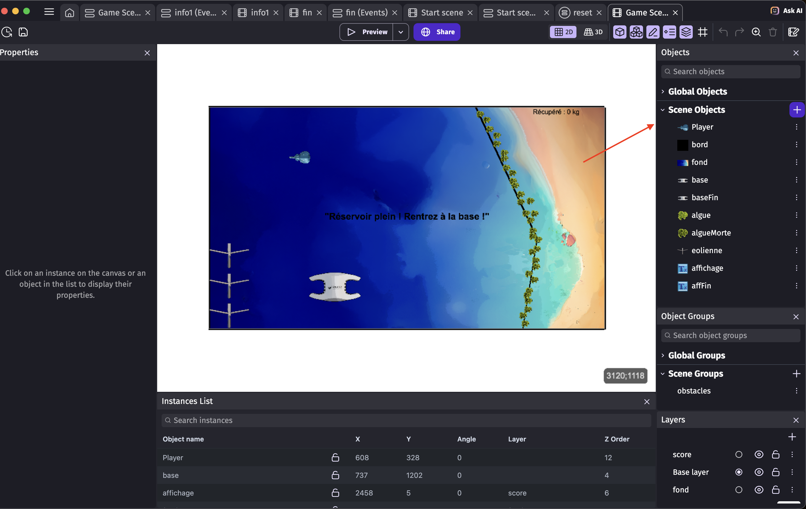
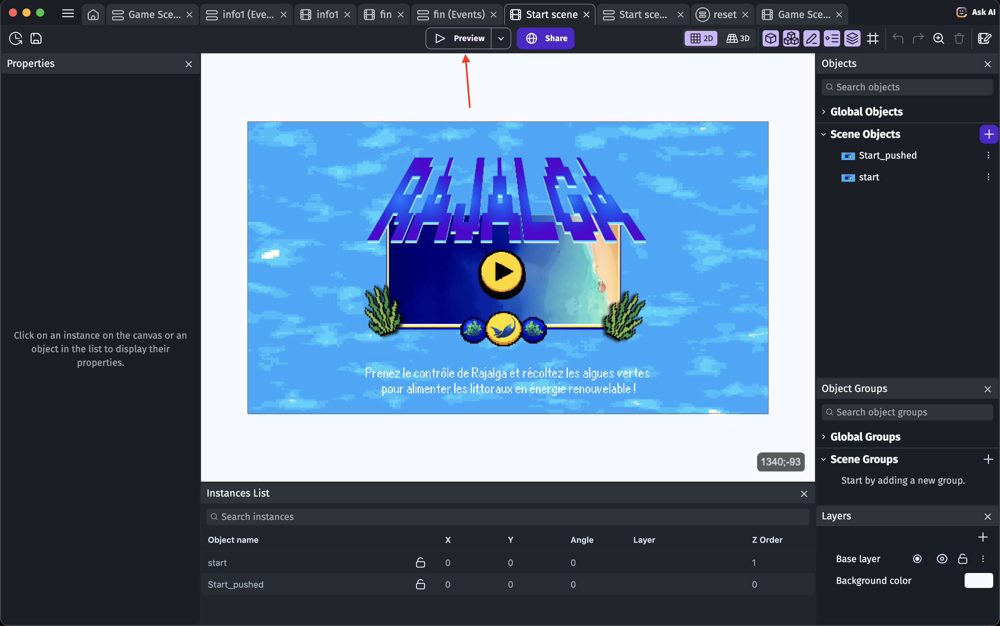
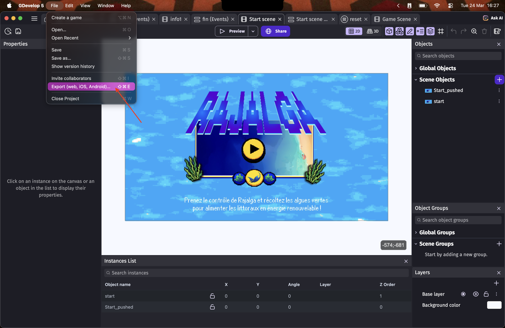
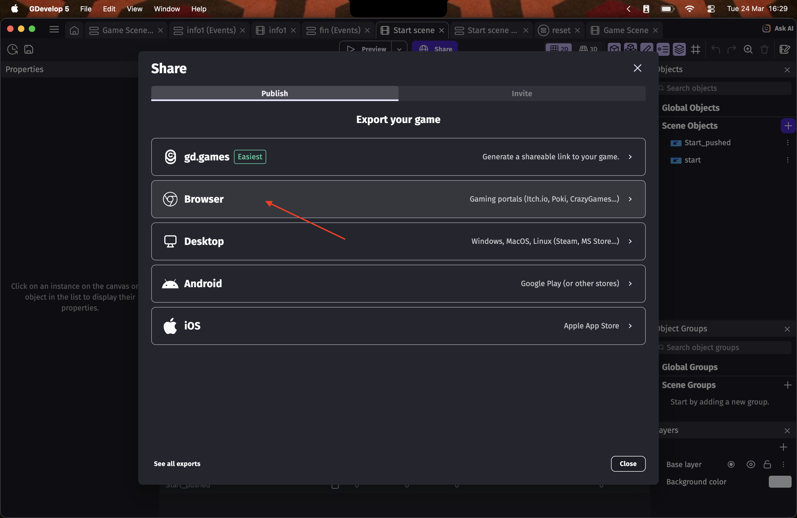
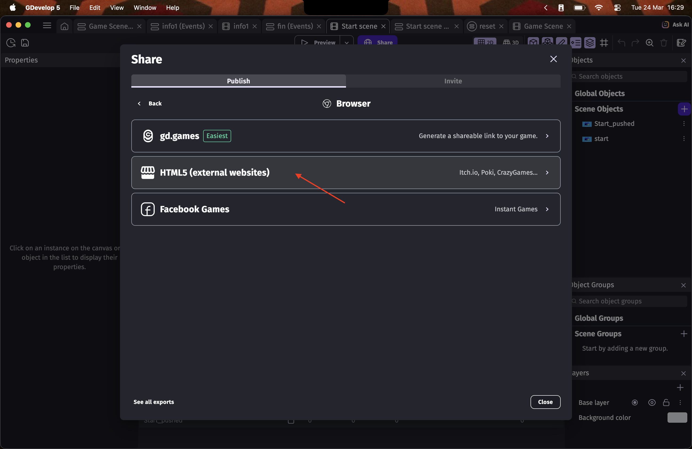
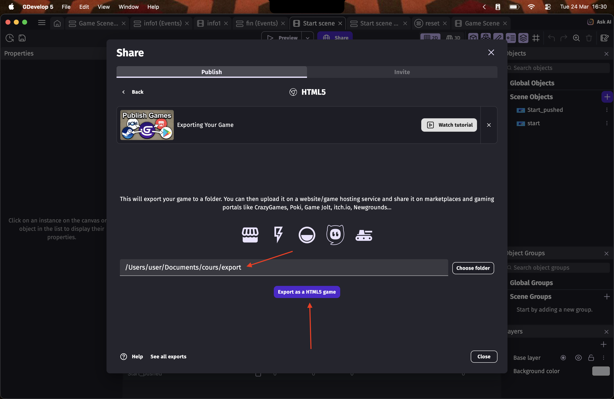
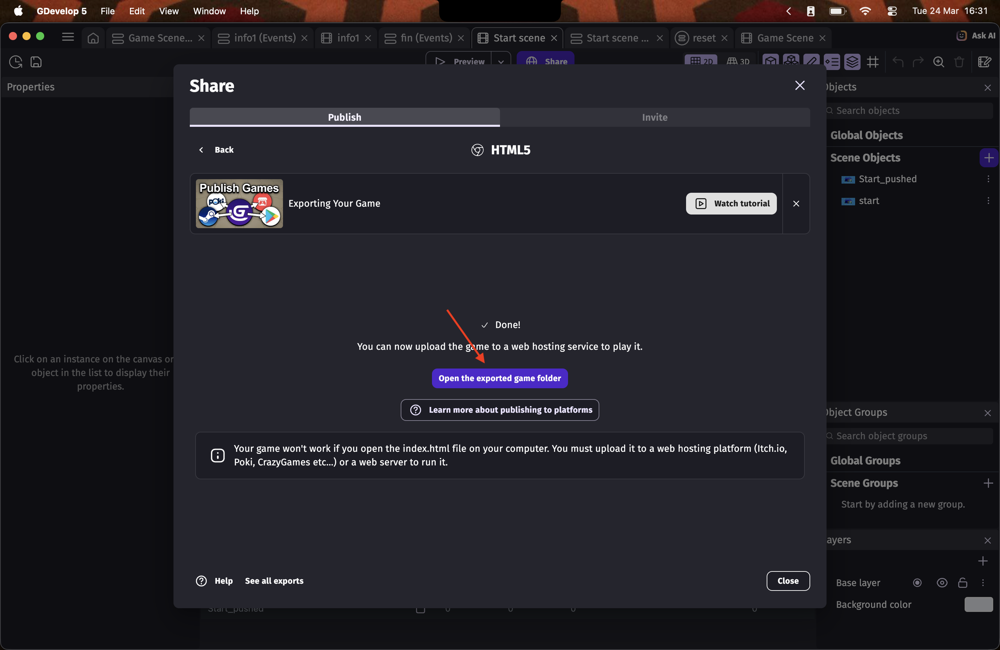

# Jeu-vidéo - Programme

Dans cette partie sera indiquée comment accéder au développement du jeu-vidéo, si jamais des Sprites (images dans le jeu) doivent être changés.

Pour un développement plus poussé, des tutoriels sont diposnibles en ligne sur le site de GDevelop, et certains agents IA peuvent vous aider.

## Prérequis

Développement du jeu : 

- [GDevelop 5](https://gdevelop.io/fr-fr/download) (besoin du logiciel sur ordinateur, la version en ligne ne permet pas certaines fonctionnalité nécessaires)

## Ouverture du jeu

1. Lancez le logiciel GDevelop 5 sur votre ordinateur. Vous serez peut-être dans l'obligation de créer un compte pour faire des actions dans le logiciel.
2. Une fois dans la page d'accueil, cliquer sur **Fichier** -> **Ouvrir**.

3. Dans la fenêtre qui apparaît en vous demandant la localisation du fichier à ouvrir, cliquez sur **Votre ordinateur**. Naviguez ensuite dans vos fichiers locaux jusqu'à trouver le fichier `Mantalga.json` (dans le même dossier que ce document).

4. Vous pourrez accéder aux différentes scènes du jeu en cliquant sur les trois barres alignées du haut.

5. La scènes principale est `Game Scene`. En cliquant dessus s'ouvriront deux onglets, un avec la scène et un avec les événements de la scène. 
6. Sur la droite de l'écran de la scène, vous trouverez la liste des Sprites (objets).

Le reste (les événements) est fonctionnel est n'est pas à changer. Si jamais des changements majeurs sont à apporter, renseignez-vous avec des tutoriel/agents IA ou dans la section [contact](#contact).

## Fonctionnement du jeu

Si vous voulez tester le jeu, selectionnez la scène `Start Scene` puis cliquez sur **Preview**.

Les contrôles sont (sur clavier) :

- **R** pour démarrer/recommencer le jeu (le démarrage du jeu nécessite d'attendre minimum 2 secondes sur l'écran d'accueil).
- **⭡⭣⭠⭢** pour contrôler la raie-robot.
- **Z** pour fermer l'information qui apparaît à l'écran.
- **W** pour passer aux informations de la base une fois le jeu terminé.
- **S** pour passer au second moteur de la base.
- **A** pour passer au dernier moteur de la base.

Il faudra à la fin appuyer sur **R** pour retourner à l'écran principal.

Le but est le suivant : 

Une fois le jeu demarré, le joueur devra récupérer les algues vertes qui apparaissent, et toutes les 3 algues une information lui sera donnée concernant le projet et son impact. Au bout de 20 algues (soit 1000kg), le joueur ne pourra plus rien récupérer et devra se diriger vers la base (entourée en vert) comme dit dans le texte. Après cela seront affichées unes à unes les étapes principales du fonctionnement de la base, qui va transformer les algues récupérée en énergie.

## Changement des Sprites

Les Sprites désignent les objets utilisés dans le jeu.
La liste des Sprites dans la scène de jeu est la suivante : 

- **Player** : le joueur, modélisé par une raie-robot.
- **Bord** : les bordures de l'écran, visibles en noir dans la scène, mais qui disparaissent au lancement du jeu, que le joueur et les algues ne peuvent pas dépasser.
- **Fond** : l'arrière-plan, qui fait toute la longueur et largeur de la zone de jeu.
- **Base** : la base qui accueille les raies-robots dans le projet, que le joueur ne peut pas traverser et qui n'a aucune interaction.
- **BaseFin** : la base qui apparaît à la place de celle initiale lorsque le joueur atteint les 1000kg d'algues, l'image est la même mais avec une bordure verte.
- **Algue** : les algues que le joueur doit récupérer au fur-et-à-mesure du jeu, qui apparaissent lorsqu'une est "mangée" ou traverse une bordure ou la base.
- **AlgueMorte** : les algues qui se situent au niveau des bordures visibles à l'écran, qui n'ont aucune interaction et servent seulement à créer une bordure visible par le joueur.
- **Eolienne** : Les éoliennes qui sont à gauche de la scène, que le joueur et les algues ne peuvent pas traverser.
- **Affichage** : l'affichage du score en haut à droite de la scène de jeu.
- **AffFin** : l'affichage qui dit "Réservoir plein ! Rentrez à la base !" qui disparaît lorsque le jeu est lancé et qui n'apparaît que lorsque que le joueur à récolté 20 algues.

Pour changer les Sprites, les étapes sont les suivantes : 
1. Cliquez deux fois sur un Sprite dans la liste de droite.
2. Cliquez sur **Ajouter un Sprite** et choisissez la localisation de l'image dans votre ordinateur.
3. Il y aura donc maintenant 2 Sprites pour un même objet, vous pouvez donc cliquer droit sur celui que vous souhaitez supprimer, et cliquer sur **Supprimer la selection**.

Les informations données en jeu et celles en rapport avec la base (de la fin) sont aussi des Sprites, que vous pouvez retrouver respectivement dans les scènes `info1` et `fin`. Les Sprites ont dans leur nom leur ordre d'apparition par le joueur et les évenements.

## Export après modifications

Après avoir appliqué vos modifications et sauvegardé, il va falloir exporter le jeu pour qu'il soit compatible pour navigateur internet et qu'il soit jouable sur la plupart des machines. Voir [ici](../web/README.md) pour plus d'informations.

1. Dans la barre en haut du logiciel, cliquez sur **Fichier** -> **Exporter**.

2. Dans la sélection de platforme, choisissez **Navigateur**.

3. Ensuite, sélectionnez **HTML5**.

4. Choisissez le dossier dans lequel seront enregistrés les données du jeu. **Conseil : créez un dossier `export` et sélectionnez celui-ci en faisant bien attention à ce que le champ de la localisation des données enregistrées finisse bien par `/export`.** Cliquez ensuite sur **Exporter en tant que jeu HTML5**.

5. Une fenêtre de confirmation devrait s'ouvrir et vous permettre d'ouvrir directement le répertoire du jeu.

Optionnel : 
Si vous voulez envoyer le jeu, compressez le dossier `export` et envoyez le fichier `.zip`.

## Contact

En cas de problème, contactez [enzo.tofani@etu.univ-nantes.fr](mailto:enzo.tofani@etu.univ-nantes.fr).