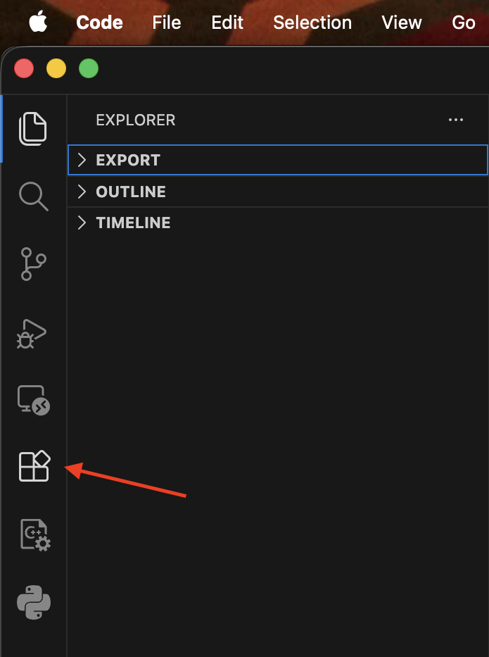
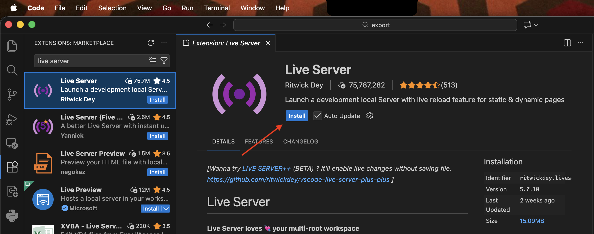
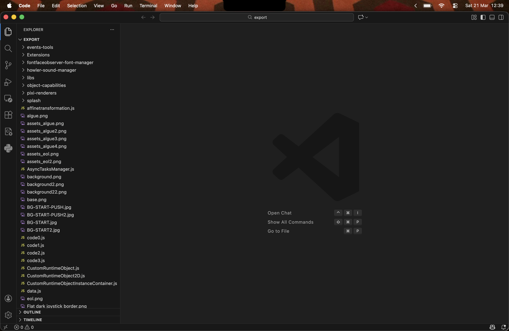
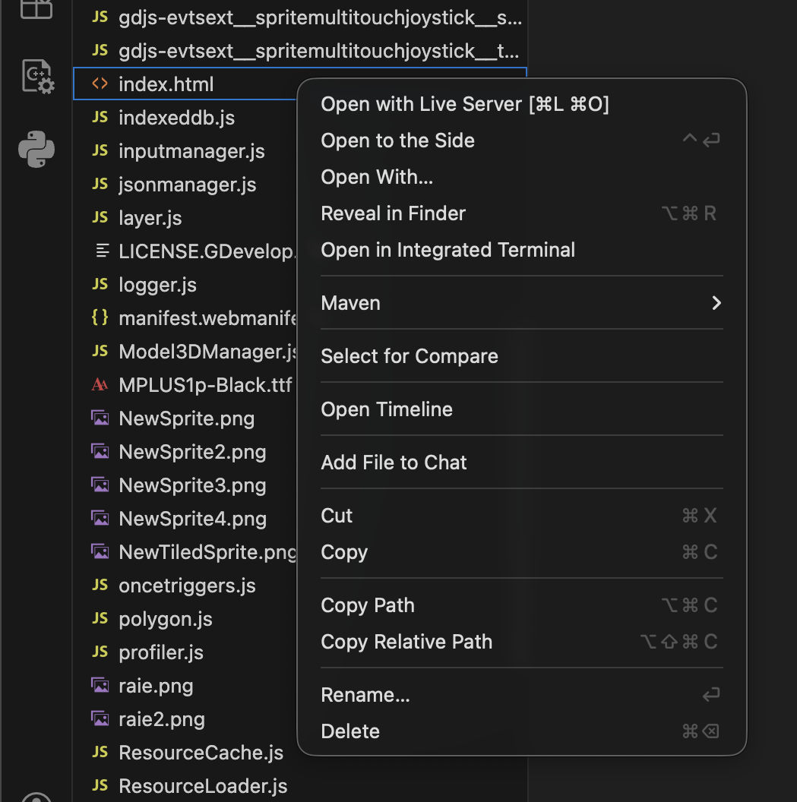

# Jeu-vidéo - Lancement

Rappel : Pour voir la partie développement et modification du jeu vidéo, allez dans le dossier `GDevelop`. Les étapes suivantes sont à réaliser une fois le jeu exporté pour navigateur web pour pouvoir le lancer (si vous l'avez modifié) ou directement depuis ce dossier.

## Prérequis

Navigateur internet : 

* [Google Chrome](https://www.google.com/chrome/)
* Navigateur Chromium (Edge, Opera, Vivaldi...)
* Non testé sur Firefox mais devrait être fonctionnel

IDE :

* [Visual Studio Code](https://code.visualstudio.com/download)

Extension pour Visual Studio Code (voir ci-dessous) :

* Live Server

## Installation de l'extension

1. Lancez Visual Studio Code (VSC) sur l'ordinateur qui va être utilisé pour le jeu-vidéo.
2. Une fois sur VSC, dans les icônes tout à gauche, cliquez sur l'icône **Extensions**.

3. Dans la barre de recherche des extensions, tapez `Live Server` et cliquez sur **Installer**.

4. Fermez et réouvrez VSC.

L'extension **Live Server** est maintenant installée, vous pouvez passer au lancement du jeu.

## Lancement

1. Lancez Visual Studio Code (VSC) sur l'ordinateur qui va être utilisée pour le jeu-vidéo.
2. Dans la barre supérieure de VSC, allez dans **Fichier** -> **Ouvrir un dossier**.
3. Séléctionnez le dossier `web` non compressé (qui ne finit pas par `.zip`).
4. Une fois ouvert dans VSC, l'interface devrait ressembler à ça, avec tous les fichiers du dossier à gauche de l'application : 

5. Dans la liste des fichiers, cherchez le fichier `index.html` et cliquez droit dessus, cet affichage devrait apparaître : 

6. Selectionnez la première ligne du menu **Ouvrir avec Live Server**. Cela devrait lancer votre navigateur par défaut directement sur une nouvelle page avec le jeu fonctionnel. Si ce n'est pas le cas, allez dans votre navigateur (voir navigateurs conseillés) et tapez dans la barre de recherche `http://127.0.0.1:5500/index.html`.

Le jeu à l'écran devrait être fonctionnel, et si tout a été fait correctement pour les branchements, les boutons et le joystick devraient faire effet. Pour un meilleur rendu, mettez votre navigateur en plein écran (touche `F11` ou `FN + F11` sur votre clavier sur Windows).

Pour arrêter le jeu, des fermetures de la page du jeu dans votre navigateur et de VSC devraient faire l'affaire.

## Contact

En cas de problème, contactez [enzo.tofani@etu.univ-nantes.fr](mailto:enzo.tofani@etu.univ-nantes.fr).
